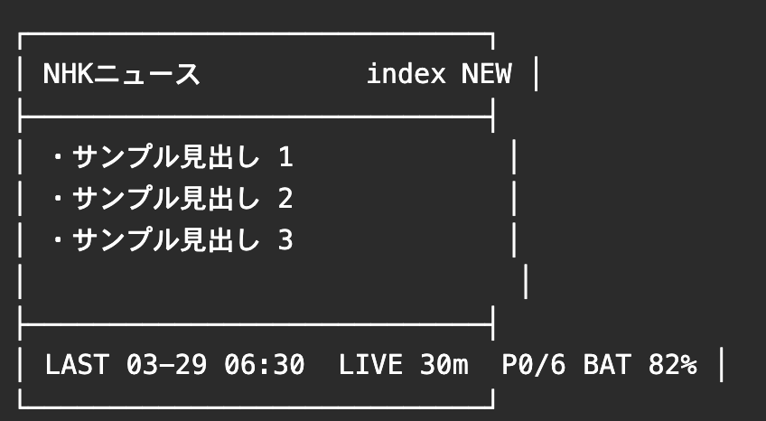

# M5PaperS3 News System

English: [README.md](README.md)

M5PaperS3 と Raspberry Pi を組み合わせて、ニュース画像を自動生成・配信・表示するシステムの統合ハブです。

このリポジトリは実装本体ではなく、全体像と導入順、各リポジトリへの入口をまとめるための案内用リポジトリです。

このプロジェクトは、対象デバイス上で日本語やその他のマルチバイト文字を直接安定表示しにくかったことから始まりました。そこで、デバイス側で文字を直接描くのではなく、Raspberry Pi 側でページを PNG 画像として生成し、M5PaperS3 側はキャッシュ、ページ遷移、更新制御に集中する構成を採っています。




詳細は次を参照してください。

- [`docs/setup.ja.md`](docs/setup.ja.md)
- [`docs/repositories.ja.md`](docs/repositories.ja.md)
- [`docs/operations.ja.md`](docs/operations.ja.md)

実装本体への入口:

- M5PaperS3 側:
  - [omiya-bonsai/M5PaperS3_NewsDashboard](https://github.com/omiya-bonsai/M5PaperS3_NewsDashboard)
- Raspberry Pi 側:
  - [omiya-bonsai/news-png-generator](https://github.com/omiya-bonsai/news-png-generator)

## 全体構成

```text
NHK RSS
   ↓
Raspberry Pi
  - make_pages_png.py
  - index.png / page1.png ... / index.version
  - http.server
  - systemd
   ↓ HTTP
M5PaperS3
  - SD cache
  - index.version 差分確認
  - タッチ / スワイプ操作
  - NEW / READ 表示
```

## リポジトリ構成

このシステムは 3 本のリポジトリで構成します。

### 1. 統合ハブ

- このリポジトリ
- GitHub:
  - [omiya-bonsai/m5papers3-news-system](https://github.com/omiya-bonsai/m5papers3-news-system)
- 役割:
  - 全体構成の説明
  - 導入順の整理
  - 各リポジトリへの入口

### 2. M5PaperS3 側

- ローカル作業ディレクトリ:
  - `/Users/tomato/Documents/Arduino/M5PaperS3_NewsDashboard`
- リポジトリ名:
  - `M5PaperS3_NewsDashboard`
- GitHub:
  - [omiya-bonsai/M5PaperS3_NewsDashboard](https://github.com/omiya-bonsai/M5PaperS3_NewsDashboard)
- 役割:
  - Arduino スケッチ
  - キャッシュ制御
  - 定期 `index` 更新
  - タッチ / スワイプ UI
  - `NEW / READ` 表示

### 3. Raspberry Pi 側

- ローカル作業ディレクトリ:
  - `/Users/tomato/Documents/projects/m5papers3-news-server`
- リポジトリ名:
  - `m5papers3-news-server`
- GitHub:
  - [omiya-bonsai/news-png-generator](https://github.com/omiya-bonsai/news-png-generator)
- 役割:
  - RSS 取得
  - PNG 生成
  - `index.version` 生成
  - HTTP 配信
  - systemd 運用

## 導入順

導入は次の順で進めると分かりやすいです。

1. Raspberry Pi 側をセットアップする
2. `index.png` と `index.version` が HTTP 配信できることを確認する
3. M5PaperS3 側で Wi‑Fi と配信 URL を設定する
4. M5PaperS3 で `index` 表示とページ遷移を確認する
5. 定期更新、先読み、`NEW / READ` 表示を確認する

## 各リポジトリで扱うもの

### M5PaperS3 側リポジトリ

入れるもの:

- Arduino スケッチ
- `README.md`
- `README.ja.md`
- `docs/`
- `config.example.h`

入れないもの:

- `config.h`
- 実際に取得したニュース PNG
- 実際の NHK コンテンツ画像

### Raspberry Pi 側リポジトリ

入れるもの:

- Python スクリプト
- `README.md`
- `README.ja.md`
- `systemd/` 配布用 unit
- `.gitignore`

入れないもの:

- `fonts/`
- 生成済み `index.png` / `page*.png`
- `index.version`
- 実ニュース画像

## 運用フロー

### 通常の編集

1. Mac 上の各リポジトリで編集する
2. 必要に応じて commit / push する
3. Raspberry Pi 側で `git pull` する
4. systemd service / timer を必要なら再起動する

### Raspberry Pi 反映

例:

```sh
cd ~/m5papers3
git pull
systemctl --user restart m5news-http.service
systemctl --user restart m5news-generate.timer
```

## 役割分担の考え方

### 統合ハブ

- 全体像を説明する
- どこを見れば何が分かるかを案内する

### M5PaperS3 側

- 表示
- UI
- キャッシュ
- 電源ポリシー

### Raspberry Pi 側

- データ生成
- 並び順制御
- 配信
- systemd 運用

## 公開方針メモ

現時点では、実 NHK コンテンツ画像や生成済み PNG は公開リポジトリへ含めない方針を前提にします。

公開対象は基本的に次です。

- コード
- 設定例
- ドキュメント
- 自作ダミー画像

## 今後このリポジトリに追加するとよいもの

- セットアップ手順の詳細
- よくあるトラブルシュート
- リポジトリ間のリンク一覧
- システム構成図

## License

このリポジトリは [MIT License](LICENSE) です。
