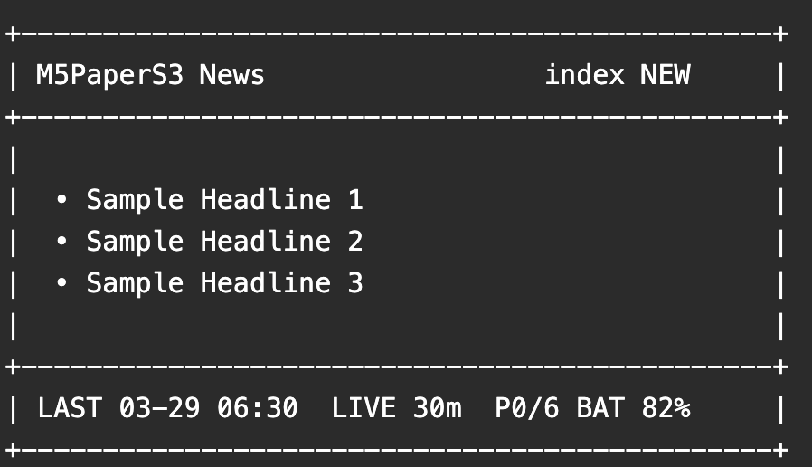

# M5PaperS3 News System

Japanese: [README.ja.md](README.ja.md)

This repository is the integration hub for a hobby project that combines an M5PaperS3 device and a Raspberry Pi to generate, serve, and display news pages.

It is intentionally not the implementation repository itself. Instead, it explains the overall architecture, setup order, and navigation across the three related repositories.




## Related Repositories

- M5PaperS3 device:
  - [omiya-bonsai/M5PaperS3_NewsDashboard](https://github.com/omiya-bonsai/M5PaperS3_NewsDashboard)
- Raspberry Pi server:
  - [omiya-bonsai/news-png-generator](https://github.com/omiya-bonsai/news-png-generator)

## Detailed Documents

- [`docs/setup.md`](docs/setup.md)
- [`docs/repositories.md`](docs/repositories.md)
- [`docs/operations.md`](docs/operations.md)

## System Overview

```text
NHK RSS
   ↓
Raspberry Pi
  - make_pages_png.py
  - index.png / page1.png ... / index.version
  - http.server
  - systemd
   ↓ HTTP
M5PaperS3
  - SD cache
  - index.version checks
  - touch / swipe UI
  - NEW / READ state
```

## Repository Layout

This project is organized into three repositories.

### 1. Integration Hub

- Repository:
  - [omiya-bonsai/m5papers3-news-system](https://github.com/omiya-bonsai/m5papers3-news-system)
- Purpose:
  - explain the whole system
  - define setup order
  - provide links to the implementation repositories

### 2. M5PaperS3 Device

- Repository:
  - [omiya-bonsai/M5PaperS3_NewsDashboard](https://github.com/omiya-bonsai/M5PaperS3_NewsDashboard)
- Purpose:
  - Arduino sketch
  - cache control
  - periodic index refresh
  - touch and swipe UI
  - NEW / READ indication

### 3. Raspberry Pi Server

- Repository:
  - [omiya-bonsai/news-png-generator](https://github.com/omiya-bonsai/news-png-generator)
- Purpose:
  - fetch RSS
  - generate PNG files
  - generate `index.version`
  - serve files over HTTP
  - run the services with `systemd`

## Recommended Setup Order

1. Set up the Raspberry Pi repository first.
2. Confirm that `index.png` and `index.version` are available over HTTP.
3. Configure Wi-Fi and the server URL on the M5PaperS3 side.
4. Confirm `index` rendering and page navigation on the device.
5. Confirm periodic refresh, prefetch behavior, and `NEW / READ` status changes.

## What Each Repository Should Contain

### M5PaperS3 repository

Include:

- Arduino sketch
- `README.md`
- `README.ja.md`
- `docs/`
- `config.example.h`

Do not include:

- `config.h`
- fetched news PNG files
- screenshots or images that contain real NHK content

### Raspberry Pi repository

Include:

- Python scripts
- `README.md`
- `README.ja.md`
- distributable `systemd/` unit files
- `.gitignore`

Do not include:

- `fonts/`
- generated `index.png` / `page*.png`
- `index.version`
- real news images

## Typical Workflow

### Normal editing flow

1. Edit the repositories on a Mac.
2. Commit and push as needed.
3. Run `git pull` on the Raspberry Pi.
4. Restart user services or timers if required.

### Raspberry Pi update example

```sh
cd ~/m5papers3
git pull
systemctl --user restart m5news-http.service
systemctl --user restart m5news-generate.timer
```

## Publication Policy

The current policy is to keep real NHK content images and generated PNG outputs out of public repositories.

What is intended to be public:

- source code
- configuration examples
- documentation
- self-made mock images

## Future Additions

- more detailed setup guides
- common troubleshooting notes
- repository-to-repository link map
- clearer architecture diagrams

## License

This repository is licensed under the [MIT License](LICENSE).
